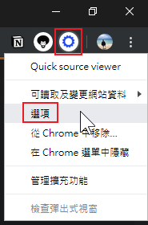
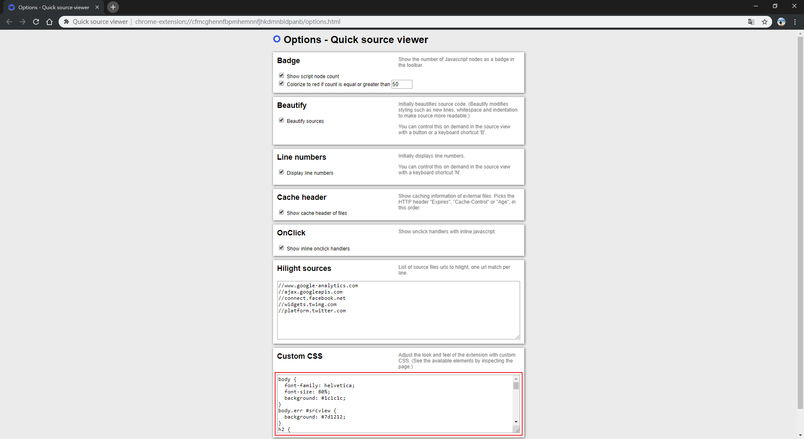
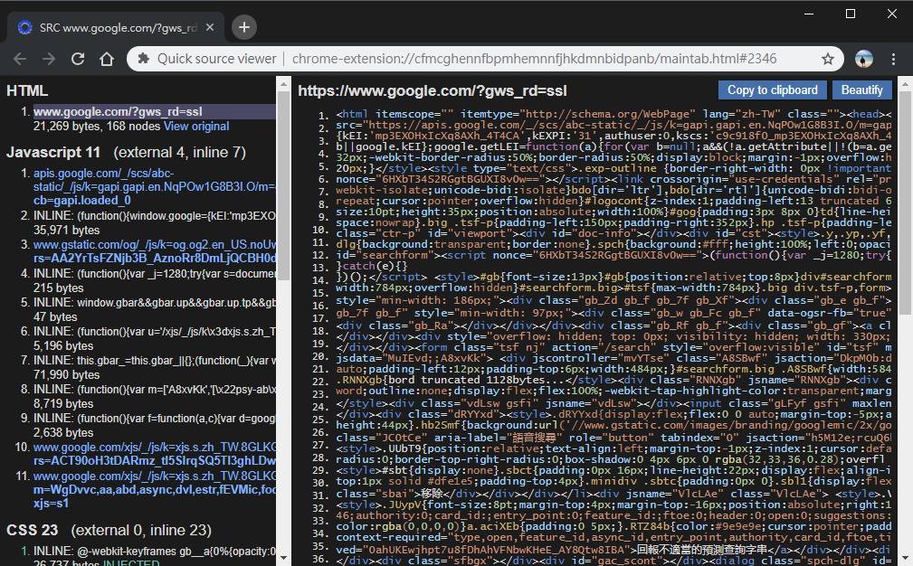
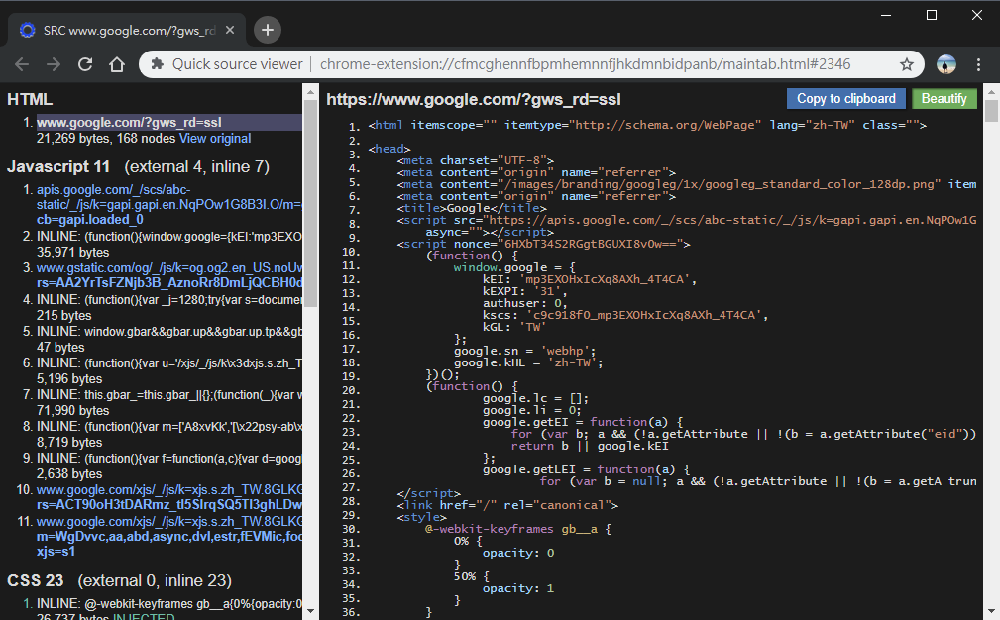

# quick-source-viewer-dark-theme
Dark theme for "[Quick source viewer](https://github.com/tomimick/chrome-ext-view-src)" (Chrome extension).

Install from [Chrome Store](https://chrome.google.com/webstore/detail/quick-source-viewer/cfmcghennfbpmhemnnfjhkdmnbidpanb?hl=en)

## Setting custom CSS
Right click on "Quick source viewer" and click on "Options".

Paste the code in "[styles.css](./styles.css)" into the "Custom CSS" field.

## Screenshots
### Source code

### Code beautify
